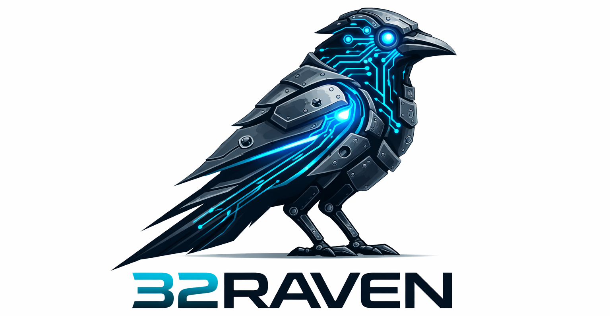

# 32Raven

**Status:** Active development. Interfaces, configs, and behavior can change quickly.

## Overview

**32Raven** is a high-performance, bare-metal flight control ecosystem designed from the ground up.

Unlike standard hobbyist stacks, 32Raven utilizes a **decoupled dual-target architecture** to ensure maximum reliability:

* **`stm32/` (The Brain):** Real-time, deterministic flight-control logic (sensors, PID loops, low-level drivers) running on STM32F407.
* **`esp32/` (The Bridge):** High-level communication, telemetry (MAVLink/CRSF), and wireless integration (WiFi/OTA).
* **`libs/`:** Shared core logic and math utilities used by both targets.

## Vision & Design Direction

The project is built on a **"Bare-Metal First"** philosophy. Our goal is to eliminate the unpredictability of heavy abstractions to achieve industrial-grade timing and control.

* **Deterministic Performance:** We prioritize minimal abstraction overhead for predictable runtime behavior.
* **HAL Strategy:** HAL is currently used for initial bring-up (clocks, peripherals). Runtime data paths are being systematically migrated to **direct register-level control**.
* **Hardware Stack:** Optimized custom drivers for the `ICM42688P` IMU and `u-blox M9N` GPS.
* **Wireless First:** Built-in support for flashing the STM32 "over the air" via the ESP32 communication bridge.

## Repository Layout

* **`stm32/`** — STM32 firmware, drivers, core flight state machine.
* **`esp32/`** — ESP-IDF firmware, MAVLink/CRSF bridge, and failsafe services.
* **`libs/`** — Shared headers and portable source code.
* **`tools/`** — Helper scripts for flashing, bridging, and telemetry dashboards.
* **`scripts/`** — Linting and project automation.

## Build Prerequisites

* **CMake** (3.22+)
* **ARM GCC toolchain** (`arm-none-eabi-*`) for STM32
* **ESP-IDF** for the ESP32 target
* **Python 3** for helper tools

> **Note:** Optional local overrides (e.g., `IDF_PATH`, serial port, baud) are read from `user_config.cmake`.

---

## Quick Start

### 1. Configure

```bash
make configure

```

### 2. Build

| Target             | Command      |
| ------------------ | ------------ |
| **STM32 Only**     | `make stm32` |
| **ESP32 Only**     | `make esp32` |
| **Complete Stack** | `make all`   |
| **Cleanup**        | `make clean` |

---

## Flashing & Deployment

### ESP32 (Serial)

```bash
make flash-esp32

```

### ESP32 (Wireless/OTA)

```bash
make flash-wifi-esp32 ESP_IP=192.168.4.1

```

### STM32 (Wireless via Bridge)

*This flashes the STM32 via the ESP32's WiFi connection:*

```bash
make flash-wifi-stm32 ESP_IP=192.168.4.1

```

---

## Technical Notes

* **Generator:** The top-level build uses `GEN` (default `Ninja`). To change: `make configure GEN="Unix Makefiles"`.
* **Output:** The STM32 binary is generated under `build/stm32/`.
* **Toolchains:** If switching generators or toolchains, always run `make clean` first.

---