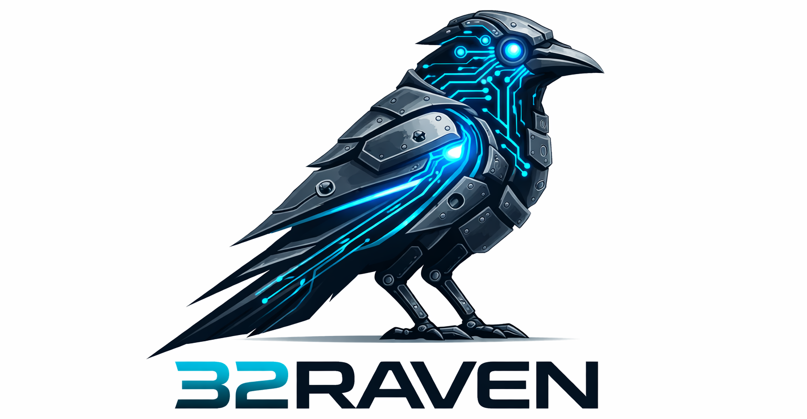
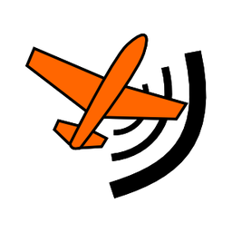
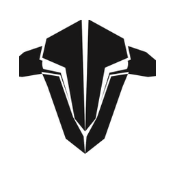
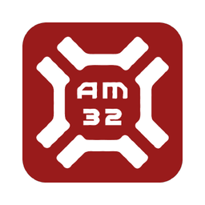

# 32Raven



**Status:** Active development. Interfaces, configs, and behavior can change quickly.

[](https://github.com/alirezazd/32raven/tags)

<p align="center">
  
  &nbsp;&nbsp;
  
  &nbsp;&nbsp;
  
  &nbsp;&nbsp;
  
  &nbsp;&nbsp;
  
</p>

32Raven is a bare-metal flight-control stack built across two MCUs: an **STM32F407** flying
the aircraft — control loop, sensors, mixer — and an **ESP32-C3** carrying the connectivity —
MAVLink/CRSF telemetry, WiFi, OTA, on-device UI. They share nothing but a versioned wire
protocol.

- **No heap, ever** — no exceptions, no RTTI, no dynamic allocation; a lint check rejects
  raw allocators.
- **No HAL** — clock, GPIO, and peripheral bring-up run register-level against CMSIS.
- **Checked at build time** — every pin assignment is validated against ST's silicon data.
- **Wireless flashing** — the STM32 is programmed over the air, through the ESP32.

📖 **[The 32Raven Handbook](https://alirezazd.github.io/32raven/)** — build one yourself:
bill of materials, wiring, firmware, flashing, and bring-up.

## Quick start

```bash
git clone --recursive https://github.com/alirezazd/32raven.git
cd 32raven
make enable-docker   # the whole toolchain runs in a container — Docker is the only prerequisite
make idf-install     # once — ESP-IDF tools
make all             # both firmwares
```

Flash — the ESP32 over USB, the STM32 over the air through it:

```bash
make flash-esp32
make flash-wifi-stm32
```

Configuration — pins, rates, WiFi — lives in one menu: `make 32raven-menuconfig`.

Host builds without Docker, flashing details, and every other target: the handbook's
**[firmware section](https://alirezazd.github.io/32raven/firmware/)**, or `make help`.

## License

32raven is **dual-licensed**:

- **GPL-3.0-only** for open-source use — see [LICENSE](./LICENSE).
- **Commercial licences** for closed-source use — contact@nordir.ca.

Copyright (C) 2026 Alireza Azadi. See [COPYRIGHT](./COPYRIGHT) for the full notice.

Third-party components under `third_party/` and vendored vendor code retain their
own upstream licences and are **not** covered by the grant above — see
[THIRD_PARTY_LICENSES.md](./THIRD_PARTY_LICENSES.md). Contributions: see
[CONTRIBUTING.md](./CONTRIBUTING.md).
