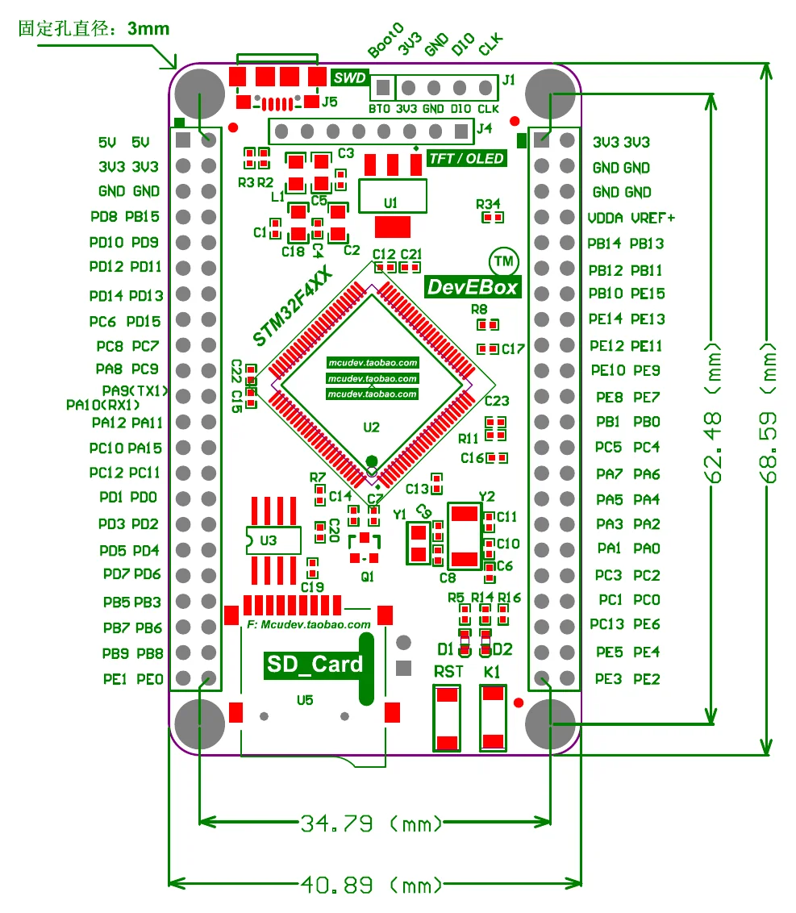
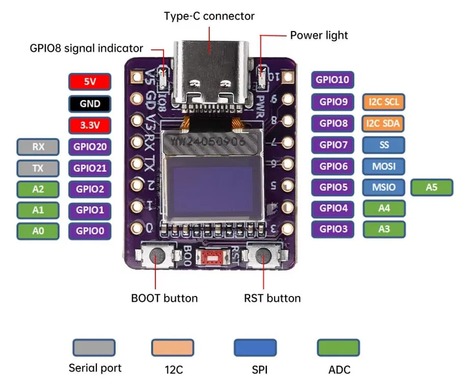
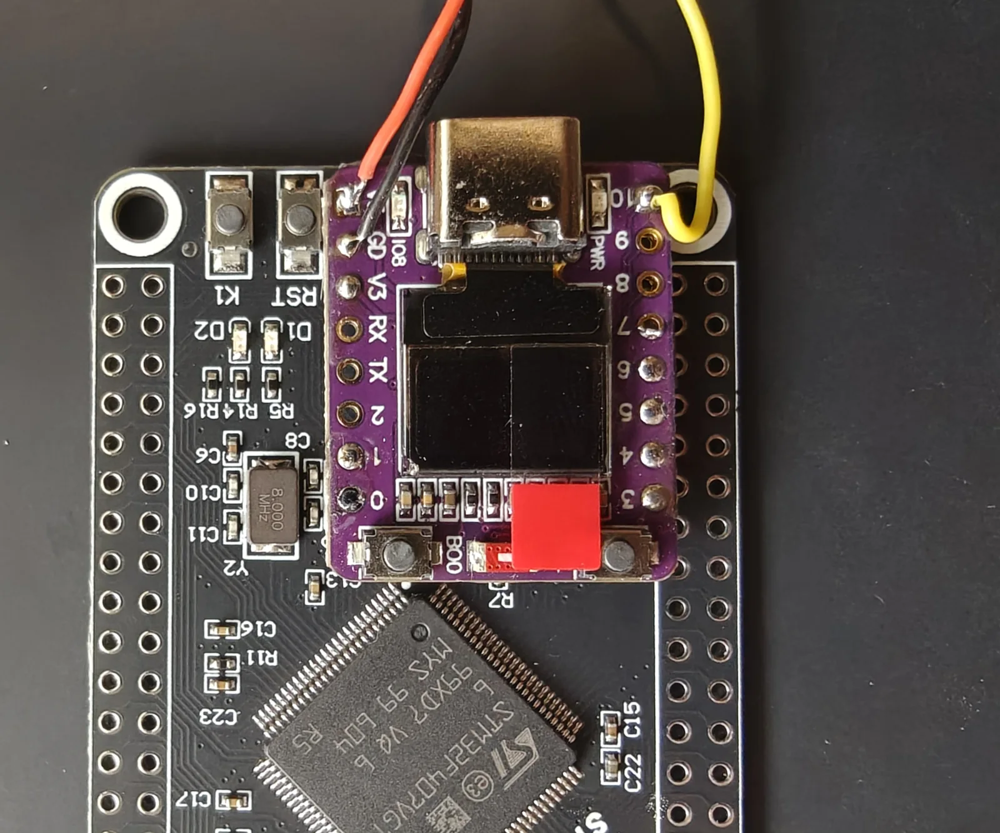
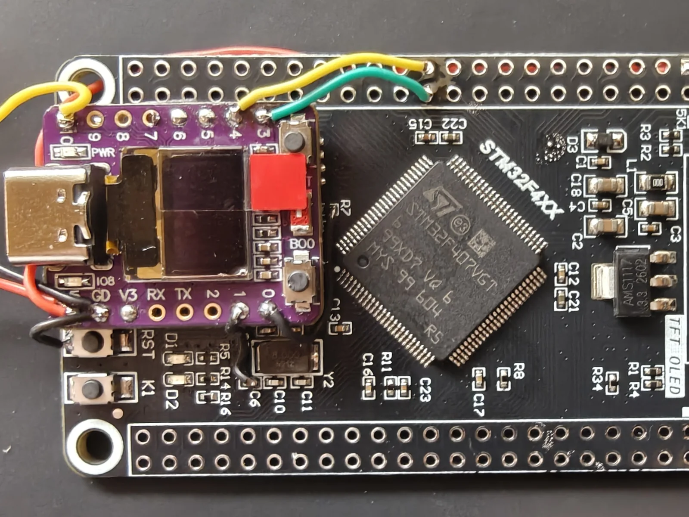
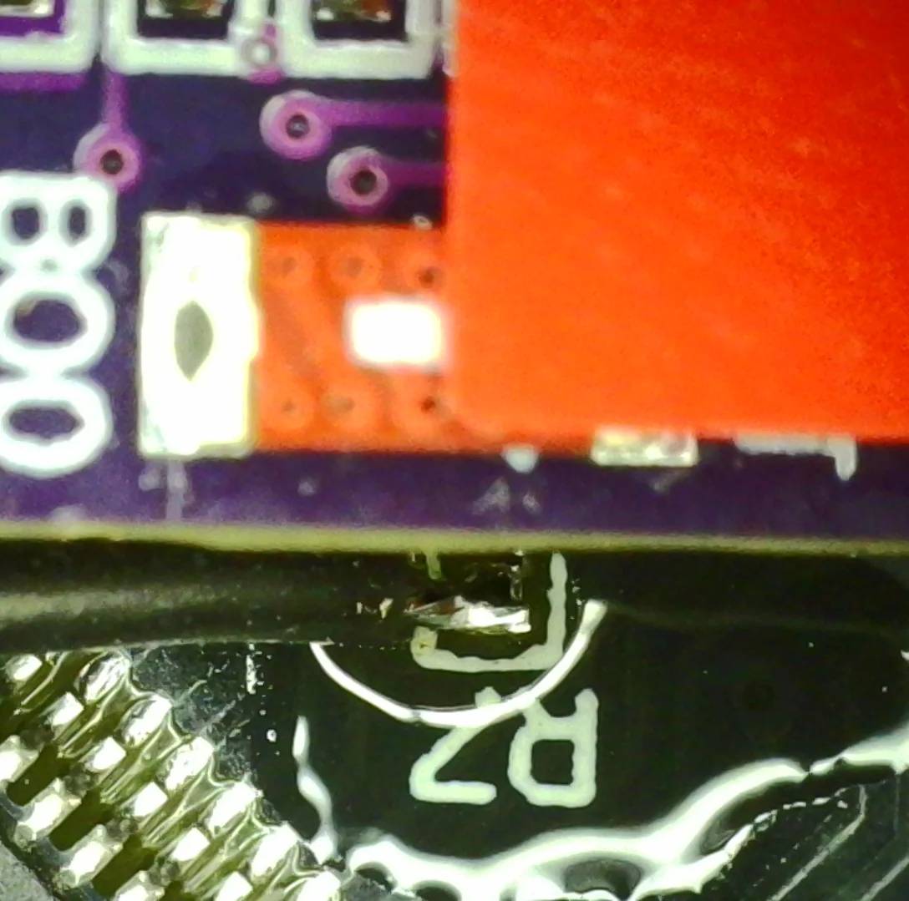
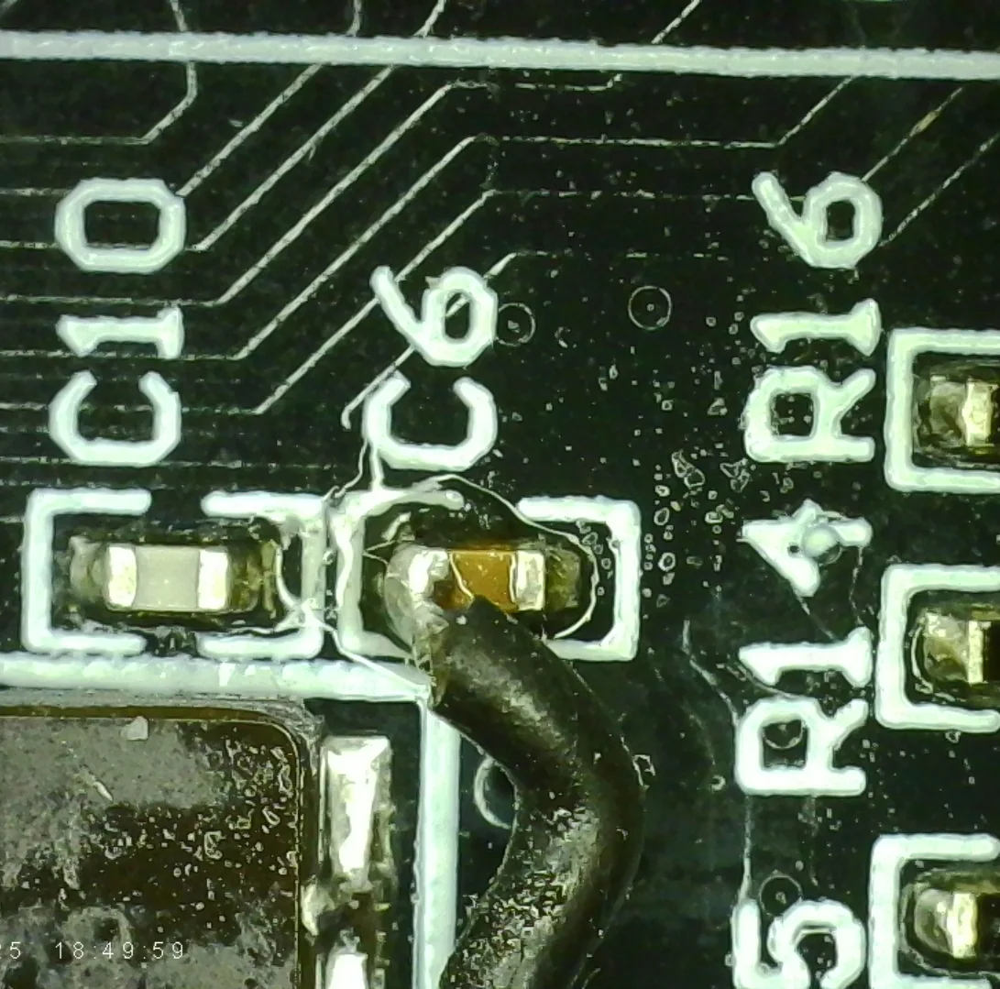
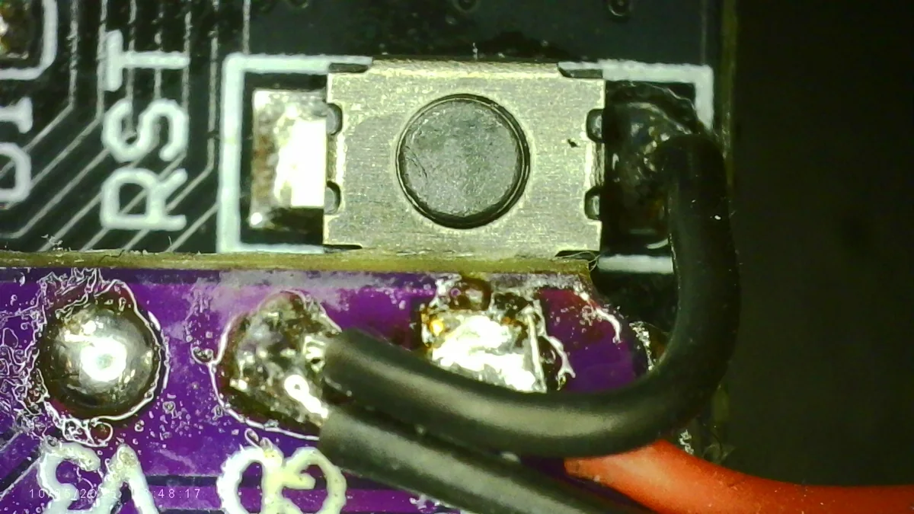
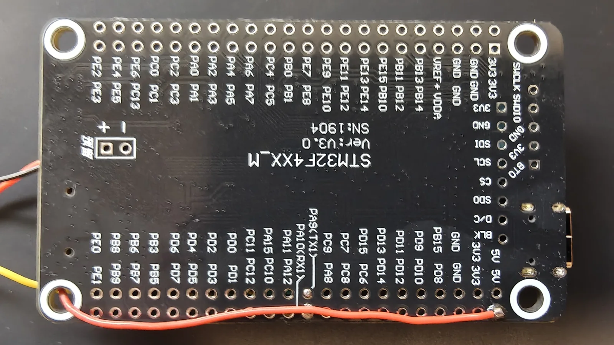

# The brain

Throughout these pages the **flight computer** is the STM32 board and the **bridge** is the
ESP32 board. The *flight controller* is the finished assembly — both boards together with the
sensor suite — not either board on its own.

## The dev boards

!!! abstract "Flight computer — DevEBox `STM32F4XX_M`"

    | | |
    |---|---|
    | MCU | STM32F407VGT6, Cortex-M4F |
    | Clock | 168 MHz (8 MHz HSE × PLL) |
    | FPU | 32-bit float, `fpv4-sp-d16`|
    | Memory | 1 MB flash, 192 KB SRAM — the VET6 variant has 512 KB |
    | Storage | W25Q16 — 2 MB SPI flash, fitted |
    | Debug | SWD, 5-pin header |
    | Size | 40.89 × 68.59 mm |

!!! abstract "Bridge — ESP32-C3 0.42″ OLED"

    | | |
    |---|---|
    | MCU | ESP32-C3, RISC-V single core |
    | Clock | 160 MHz |
    | Memory | 4 MB flash |
    | Radio | WiFi 2.4 GHz b/g/n, BLE 5.0 |
    | Display | 0.42″ SSD1306, 72 × 40 visible |
    | Debug | USB-C, native USB Serial/JTAG (no USB-to-serial chip) |
    | Size | 24.8 × 20.45 mm |

### Pinouts

/// caption
**Left** — flight computer: board dimensions and pin map, drawn by the vendor (mcudev), hosted
by [stm32-base.org](https://stm32-base.org/boards/STM32F407VET6-STM32F4XX-M).
**Right** — companion board, from the
[Fritzing forum part thread](https://forum.fritzing.org/t/esp32-c3-oled-0-42-mini-board-part/25830);
its I²C labels are **wrong** — see [the warning below](#bridge-esp32-c3-042-oled).
///

## What is already wired

### Flight computer — DevEBox STM32F4XX_M

Three things on this board are not accidents of choice — the firmware expects them:

**The SPI flash is on the pins the firmware uses.** `CS` `PA15`, `CLK` `PB3`, `DI` `PB5`,
`DO` `PB4` — exactly the SPI1 assignment in [the wiring reference](wiring.md#onboard-flash-spi1).
The W25Q16 is fitted from the factory. Nothing to wire.

**The LED and button are the ones the firmware drives.** `D2` on `PA1` is wired in sink mode,
so it is **active low**. `K1` on `PA0` is **active high**.

**The 8 MHz crystal is why the clock configuration works.** `CONFIG_STM32_RCC_PLL_M` is 8
and `PLL_N` is 336: 8 MHz ÷ 8 = 1 MHz into the PLL, × 336 = 336 MHz, ÷ 2 = 168 MHz exactly. A
board with a different crystal needs `PLL_M` changed to keep the PLL input at 1 MHz, or the
core runs at the wrong speed and every timing in the firmware moves with it. Set it to your
crystal frequency in MHz under `make 32raven-menuconfig` → **STM32 → Peripherals → RCC →
PLLM (input divider, 2..63)**.

!!! caution

    **Leave the TFT/OLED header (J4) empty.** `J4` carries `SDI` `PB15`, `SCL` `PB13`, `CS`
    `PB12`, `SDO` `PB14` — the same SPI2 bus the IMU sits on. The IMU has its own chip select
    (`PA4`), so an empty header is harmless. But anything plugged into `J4` shares a bus with
    the sensor the aircraft flies on.

### Bridge — ESP32-C3 0.42″ OLED

Every pin on this board falls into one of three groups — spoken for by the board, reserved by
the chip, or free:

**The display, LED and button are on the board.** The SSD1306 panel is on `GPIO5` (SDA) and
`GPIO6` (SCL), the LED on `GPIO8`, the BOOT button on `GPIO9`. Nothing to connect.

**Six pins belong to the chip.** `GPIO12`–`GPIO17` are the internal SPI flash and
`GPIO18`/`GPIO19` are USB D−/D+. Neither is available to you.

**The rest are yours.** `GPIO0`/`GPIO1` drive the flight computer's `BOOT0` and `NRST`,
`GPIO3`/`GPIO4` carry FcLink, `GPIO10` the buzzer, and `GPIO20`/`GPIO21` the telemetry UART.
`GPIO2` and `GPIO7` are spare. All of them are on a header, so nothing on this board needs
soldering to the PCB itself — unlike the flight computer, where one signal reaches no header
at all.

!!! caution

    **The labels on and about this board are wrong in two places.**

    The vendor drawing in [Pinouts](#pinouts) marks `GPIO8` as **I2C SDA** and `GPIO9` as
    **I2C SCL** — the generic ESP32-C3 defaults printed on a template, not this board's
    wiring. Here `GPIO8` is the onboard LED and `GPIO9` is the BOOT button; the display is on
    `GPIO5` (SDA) and `GPIO6` (SCL) at address `0x3C`. Because the I²C peripheral is routed to
    the panel, **there is no second I²C bus** for external sensors.

    The board's own silkscreen marks `GPIO20` as **RX** and `GPIO21` as **TX**, following the
    chip's default UART0 assignment. This firmware drives them the other way round — `GPIO20`
    is telemetry **TX** and `GPIO21` is **RX**. The ESP32-C3 routes any UART to any pin
    through its GPIO matrix, so this is legal and works; it also means wiring by the printed
    label gives a dead link with nothing in the logs. Wire by GPIO number.

## Stacking the boards

The bridge sits on top of the flight computer, over the microSD slot, on double-sided foam
tape. It is the first physical step of the build, and the tape is the part to get right — it
is holding two live boards apart as much as it is holding them together.

!!! warning

    **The tape is a spacer, not just adhesive.** The bridge's underside is exposed pads and
    via tails; the microSD slot it mounts over is a **metal shell**. Pressed together, they
    short.

    So the tape has to be **foam, 1.2 mm or thicker** — thin transfer tape sticks perfectly
    well and leaves almost nothing between a live board and a grounded can. Before powering
    the stack, sight along the seam and confirm nothing is touching.

Two more things to get right while the tape is still repositionable:

- **Keep the tape off the castellations.** Both header rows have to stay solderable from
  above, and the pads run right to the board edge.
- **Leave the USB-C connector clear, facing off the edge.** The bridge is flashed over it, and
  it is the only USB port this build ever uses.

{ loading=lazy }

/// caption
The finished stack.
///

!!! note

    **Ignore the wires in the figure.** They are the buzzer, already fitted when this photo
    was taken. It is not part of stacking the boards — see [Buzzer](peripherals.md#buzzer).

## Wiring the core

Six wires join the two boards — power, ground, the two-wire link, and the two bootloader
control lines. Nothing else is connected at this stage: no sensors, no power distribution, no
battery.

{ loading=lazy }

/// caption
The finished core.
///

!!! note

    **The full board schematic is published by
    [stm32-base.org](https://stm32-base.org/boards/STM32F407VET6-STM32F4XX-M).** Worth tracing
    these nets yourself before committing an iron to them.

!!! warning

    **The OLED marks permanently, and it sits a few millimetres from every pad you solder.**
    It covers most of the bridge board, it is plastic over glass, and the panel is not a
    separate module you can replace. The tip's **point** is not the danger — you are watching
    that. The danger is the **side of the tip and the shaft behind it**, swinging in while
    your eyes are on the joint.

    Come in from the outside edge, keep the iron's body angled away from the centre of the
    board, and pull clear entirely between attempts rather than pivoting over the panel.

    `R7` and `C6` are the two surface-mount joints on the core. Do them first, while the board
    is still bare and there is nothing to reach over. The technique is in
    [what you need to be able to do](index.md#what-you-need-to-be-able-to-do).

### Bootloader control lines

--8<-- "docs/build/wiring.md:programming"

Finding these two on the flight computer is the awkward part of the build. `BOOT0` is easy;
`NRST` is the only signal on this board that is not brought out anywhere.

#### BOOT0

Two places to get it, both fine, and both marked on the [flight computer pinout](#pinouts).

- **`J1` pin 1.** The SWD header, top right. Taking pin 1 does not cost you the debugger,
  which only needs pins 3, 4 and 5. No surface-mount work at all.
- **`R7`.** The 10 kΩ pulldown on the same net, between the main chip and the microSD slot.

!!! note

    **The reference build uses R7**, because it sits closer to where the bridge is mounted —
    a shorter wire and a tidier stack, which is its own reward on an aircraft.

    It is also the harder tap of the two, and the riskier one. R7 is a smaller part than C6,
    so there is less pad to aim at and less mass to absorb heat: it burns, and lifts, sooner.
    If you would rather not solder to it, take `J1` pin 1 instead — electrically identical,
    no surface-mount work, and nothing else about the build changes.

#### NRST

This one needs an iron on a surface-mount pad. On the whole board `NRST` exists in exactly two
places: the `RST` tactile switch, and one end of **C6**, the 100 nF reset capacitor (marked
`104`) that runs from `NRST` (pin 14) to ground.

!!! caution

    **On both parts, one pad is the signal and the other is ground.** R7 and C6 each run from
    their signal to GND. Land on the wrong end and you wire the bridge's `GPIO0` or `GPIO1`
    straight to ground.

    That failure is silent. The board powers up, runs firmware, and looks completely healthy —
    it simply never resets and never enters the bootloader, with nothing in any log to say
    why.

    **Make sure it is C6, not C9.** `C9` sits nearby and looks identical, but it is a 10 pF
    load capacitor. C6 has `C10` immediately to its left and `R14`/`R16` to its right — see
    the photograph below.

    **Check continuity to GND before soldering.** The pad that beeps is the wrong one.

{ loading=lazy }

{ loading=lazy }

/// caption
The two surface-mount taps under a microscope. Left: `BOOT0` on **R7**. Right: `NRST` on
**C6**.
///

### The link

--8<-- "docs/build/wiring.md:fclink"

### VCC and GND

Two wires tie the boards into one circuit: the `5V` nets share a rail, so powering either
board powers both, and the ground gives every signal between them a common reference.

Ground is taken from **a leg of the `RST` tactile switch**, which sits right beside the bridge
and keeps the run short.

!!! tip

    **Any ground will do.** There is nothing magic about the switch. The flight computer has
    ground pins on both headers, and any of them is electrically identical. The switch leg was
    chosen because it is close to the bridge and keeps the build tidy — if a header pin suits
    your layout better, use it.

And finally the 5 V wire: the bridge's `5V` pad to either of the flight computer's `5V` pins,
the top pair on the left header.

!!! tip

    **Route it underneath.** The 5 V pads are far enough from the bridge that this wire is the
    longest of the six, and on the top face it would sprawl across the board. Threaded through
    a hole and run along the back, it takes up almost no room.

{ loading=lazy }

{ loading=lazy }

/// caption
**Left** — the ground wire on the `RST` switch. **Right** — the 5 V run on the underside.
///

!!! warning

    **The 5 V pins have no protection.** The `+5V` pins connect **directly** to the USB
    connector's `+5V` — no diode, no current limiting. Anything that back-feeds those pins
    reaches the USB rail unimpeded.
