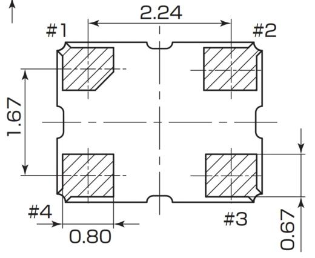
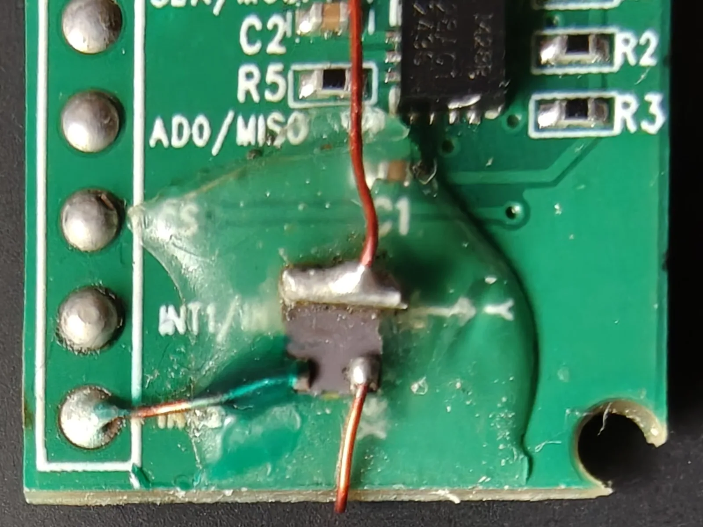
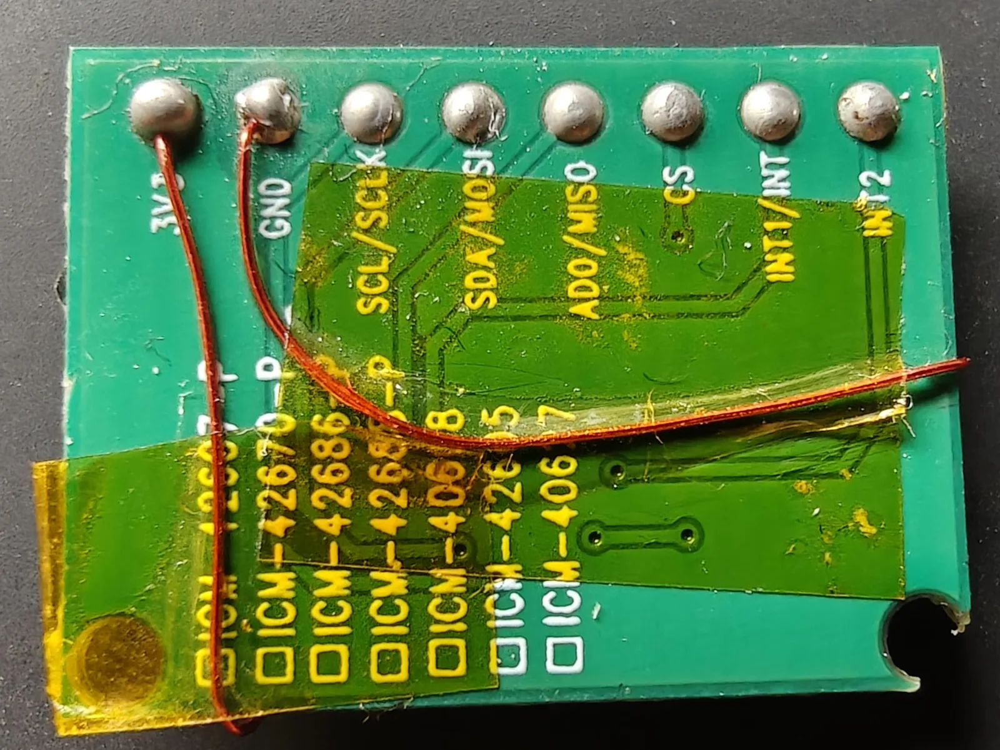
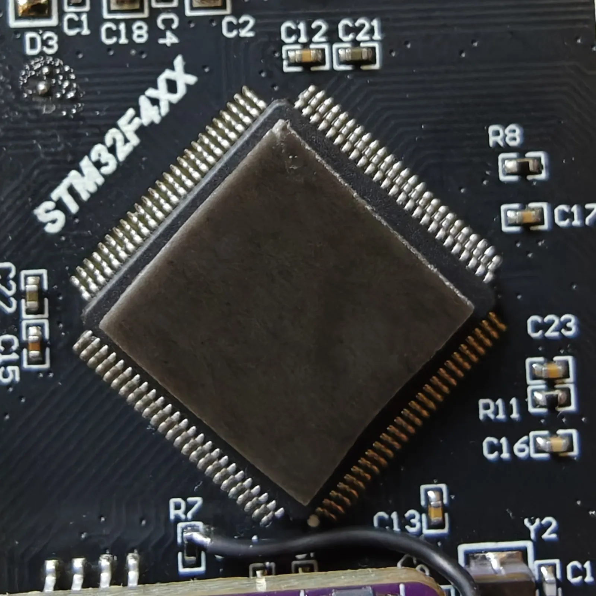
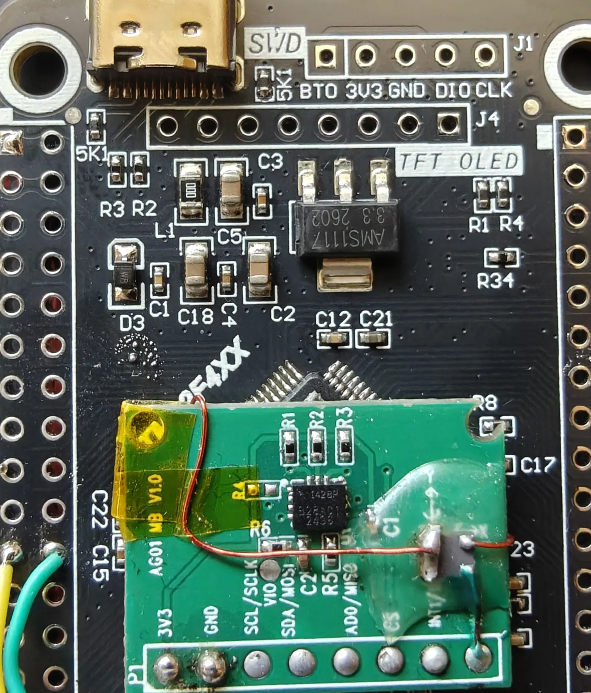
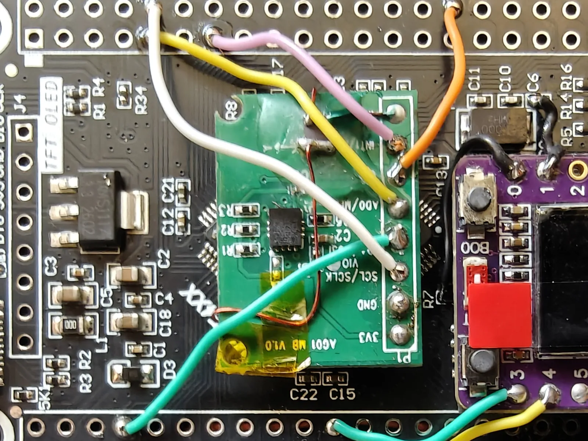
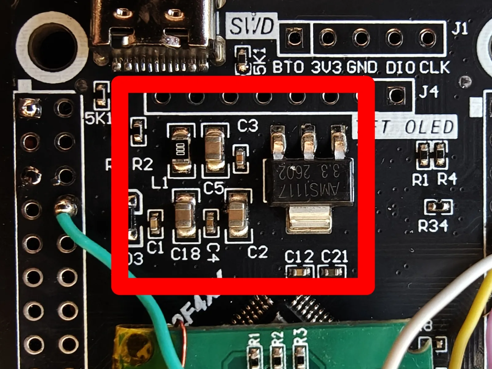
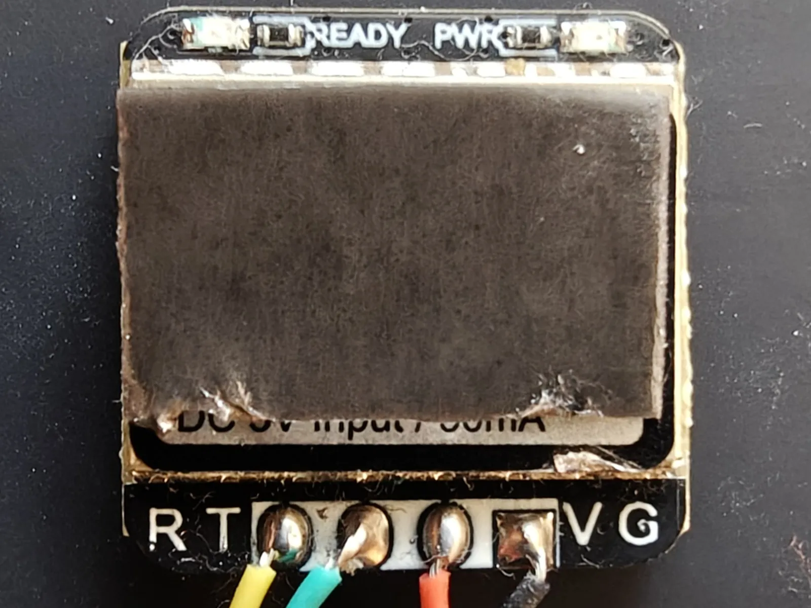
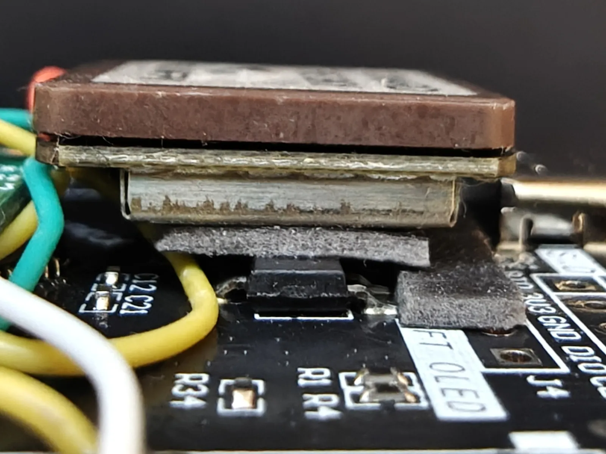
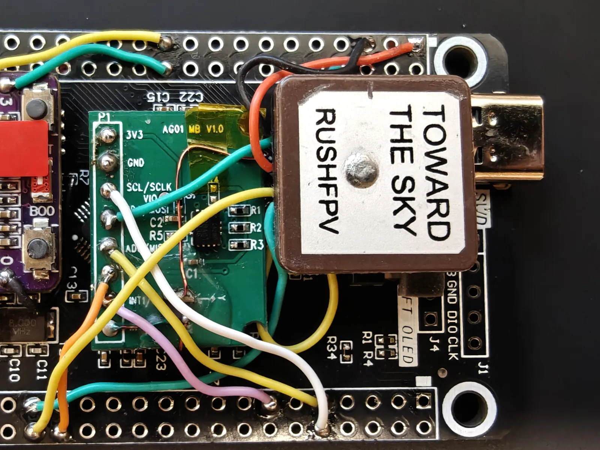

# Sensors and peripherals

Everything that hangs off the core once the two boards are joined — where each part sits, how
it is held there, and which way it faces.

## IMU — ICM42688P

The one sensor the aircraft cannot fly without: a 6-axis MEMS gyroscope and accelerometer, and
a high-performance one by consumer-grade standards — low gyro noise, and little offset drift
over temperature. Figures below are from the TDK datasheet, document `DS-000347` rev 1.8.

!!! abstract "ICM-42688-P"

    | | |
    |---|---|
    | Resolution | 16-bit, or 19-bit gyro and 18-bit accel through the FIFO |
    | Max ODR | 32 kHz |
    | FIFO | 2 kB |
    | Interface | SPI up to 24 MHz, I²C up to 1 MHz, I3C up to 12.5 MHz |
    | Supply | 1.71–3.6 V |

### External crystal (optional)

Every sample the IMU takes is timed by a clock, and by default that clock is an oscillator on
the sensor's own die. It moves with temperature at the percent level. Attitude is gyro rate
integrated against the sample interval, so that error scales the integrated angle, and no
tuning removes it because it is not a bias.

A TCXO — temperature-compensated crystal oscillator — answers this. It is a crystal that
corrects its own drift as it heats and drives its own output, holding a few ppm where a bare
32.768 kHz crystal would wander by tens.

Pin 9 of the ICM-42688-P doubles as `CLKIN`. Feed a clock in and it overrides the internal
oscillator. `INT2`, the pin's other function, is unused here, so it costs one component and
three wires. Worth doing if you are up for the micro-soldering — see
[what you need to be able to do](index.md#what-you-need-to-be-able-to-do).

The reference build uses a **KDS DSK321STD** — 3.2 × 2.5 mm, ±5 ppm across −40 to +85 °C,
about 1.7 µA.

!!! note

    **Any frequency from 31 to 50 kHz works.** The firmware adjusts its timing to whatever you
    declare, so 32.768 kHz is what the reference build happens to fit, not a requirement.

!!! warning

    **The reference build already has this switched on**, and expects a 32.768 kHz clock on
    pin 9. If you choose to skip it, turn it off under `make 32raven-menuconfig`
    → **STM32 → IMU → ICM42688P → Clock** before you fly. The default is off; this build is
    the exception.

{ loading=lazy }

| TCXO pad | Function | IMU breakout pad |
|---|---|---|
| `#1` + `#4` | Vcc — bridged | `3V3` |
| `#2` | GND | `GND` |
| `#3` | Output | `INT2` |

/// caption
Pinout and land pattern from the KDS datasheet, dimensions in mm.
///

Glue first. The oscillator goes down on a drop of silicone with pad `#3` facing the breakout's
`INT2` pad, so the output run has nowhere to go but straight across.

Once it has cured, wire it. All three runs are enamelled, stiff enough to hold the shape you
bend into them. The output is the run that matters and the shortest: `#3` to `INT2`, a few
millimetres, no detour.

Vcc lands on two pads, `#1` and `#4`, the pair on one long side of the package — the part will
not run off one alone. Bridge them with a bar of solder and feed the bridge from a single wire;
the short in the photographs is deliberate.

Supply and ground both go round the edge of the breakout to the `3V3` and `GND` pads on the
back, held flat on the way with Kapton tape.

{ loading=lazy }

{ loading=lazy }

/// caption
**Left** — the oscillator on the front, bedded in silicone. The solder bar across its top edge
is `#1` and `#4` bridged; the green wire runs from `#3` to the `INT2` pad. **Right** — the back,
where the supply pair lands on `3V3` and `GND`.
///

!!! note

    **The oscillator can take up to 3 seconds to start.** That is far longer than the STM32
    takes to boot, so the IMU may see no clock at all on its first attempt at initialising.

### Mounting

Cut a square of duct tape to the size of the STM32's package, stick it to the top of the chip,
and press the sensor breakout down onto it with its `Y` arrow (silkscreened just left of `C1`)
pointing at the USB/SWD end of the flight computer.

{ loading=lazy }

{ loading=lazy width="85%" }

/// caption
**Left** — the tape cut square to the package, on the chip's own 45°. **Right** — the sensor
down on it, `Y` pointing at the USB/SWD end.
///

!!! caution

    **The breakout overhangs the chip's leads on all four sides.** The package lid stands proud
    of the leads and the tape adds to that, so a clean board clears them — but check the
    underside for stray solder before you press it down. A blob there lands across a row of QFP
    pins.

!!! note

    **The tape is a damping layer too, not just adhesive.** Duct tape is compliant, so it takes
    some of the motor vibration out of the path to the sensor.

### Wiring

Five wires — SPI2 plus the data-ready interrupt. A trivial run: the pads on both boards are
generously sized, close together and easy to reach. Find each pin on the
[flight computer pinout](boards.md#pinouts) and run it across.

| IMU pad | Signal | STM32 |
|---|---|---|
| `SCL/SCLK` | SPI clock | `PB13` |
| `SDA/MOSI` | MOSI | `PB15` |
| `AD0/MISO` | MISO | `PB14` |
| `CS` | Chip select | `PA4` |
| `INT1` | Data ready | `PB10` |
| `3V3` | Supply | *leave unconnected* |
| `GND` | Ground | *leave unconnected* |

!!! note

    **`INT1` is not optional.** The control loop runs off the sensor's data-ready edge rather
    than a timer, so an IMU wired without it gives you a flight controller that never runs an
    iteration.

    **Leave `3V3` and `GND` off for now.** Power delivery is `TBD(#4)`. The IMU is to run from
    its own **LT3042** low-noise 3.3 V regulator rather than off the flight computer's rail,
    and that module is not fitted yet.

{ loading=lazy width="50%" }

/// caption
White `SCL/SCLK`, green `SDA/MOSI`, yellow `AD0/MISO`, orange `CS`, pink `INT1`. The two pads
nearest the corner, `3V3` and `GND`, are bare.
///

## RC receiver — ELRS

`TBD(#4)` — **being written.** ExpressLRS speaks CRSF, which the firmware reads on USART6 at
420000 baud. Those pins are not in the pin map, so confirm them against your board before
wiring.

## GPS

`TBD(#4)` — **being written.** Position, velocity and time. The reference build uses a
**RushFPV** module built on a u-blox M10 receiver. Below are its key specifications, from
RushFPV's published figures.

!!! abstract "RushFPV M10"

    | | |
    |---|---|
    | Constellations | GPS, GLONASS, Galileo, BeiDou — up to 4 at once, plus SBAS and QZSS |
    | Receive channels | 72 |
    | Update rate | 1–10 Hz |
    | Sensitivity | −162 dBm |

Four wires, on USART2, with the pair crossed: the module's `RX` goes to the STM32's transmit
pin, and its `TX` to the receive pin.

| GPS pad | Signal | STM32 |
|---|---|---|
| `VCC` | Supply | `5V` |
| `GND` | Ground | `GND` |
| `RX` | ← STM32 TX | `PA2` |
| `TX` | → STM32 RX | `PA3` |

!!! note

    **Check what your module wants before you connect it.** Supply voltage is the vendor's
    choice, not u-blox's — the receiver itself runs at 3.3 V, but most boards carry their own
    regulator and expect more. The reference module's pad is labelled `5V`, so it goes to the
    flight computer's 5 V rail.

### Mounting

It goes on the patch of passives between `J4` and the STM32, patch face up. That area is not
flat. Pack the low ground up with small pieces of duct tape until it is level with the tallest
parts, then put a piece on the module's own back to stick it down.

!!! note

    **The patch has to see the sky.** Mount it face up with nothing metallic or carbon above
    it, and as far from the ESCs and any video transmitter as the frame allows. Switching noise
    from either is the likeliest reason a fix never arrives.

{ loading=lazy }

{ loading=lazy }

{ loading=lazy }

{ loading=lazy }

/// caption
**Top left** — the suggested spot. **Top right** — tape on the module's back. 
**Bottom left** — the packing from the side, filling in around the taller parts.
**Bottom right** — the finished mount.
///

## Compass

`TBD(#4)` — **planned.** A magnetometer gives an absolute heading, which gyro yaw drifts away
from on its own, so anything that holds a position or flies a course depends on it. No driver
in the firmware yet and no pins assigned. Siting will matter more than wiring — motors and
current-carrying wire are what corrupt it.

## Barometer

`TBD(#4)` — **planned.** Altitude hold and vertical speed need a pressure reference; the IMU
alone cannot tell a climb from an accelerometer bias. No driver in the firmware yet and no pins
assigned. The reference build will use a MicoAir module, model `TBD(#4)`.

## Telemetry radio

`TBD(#4)` — **planned.** The MAVLink link down to a ground station. It hangs off the bridge on
`GPIO20` and `GPIO21`, not off the flight computer.

## Buzzer

`TBD(#6)` — the buzzer runs from `GPIO10` on the bridge. It is already fitted in the
photographs on [The brain](boards.md); wiring it is a stage of its own.

## Locator beacon

`TBD(#4)` — **planned.** A loud buzzer and a high-intensity LED, for finding the aircraft after
it lands somewhere you did not intend. Separate from the [buzzer](#buzzer) above, which is a
status tone on the bridge and nowhere near loud enough for the job.
