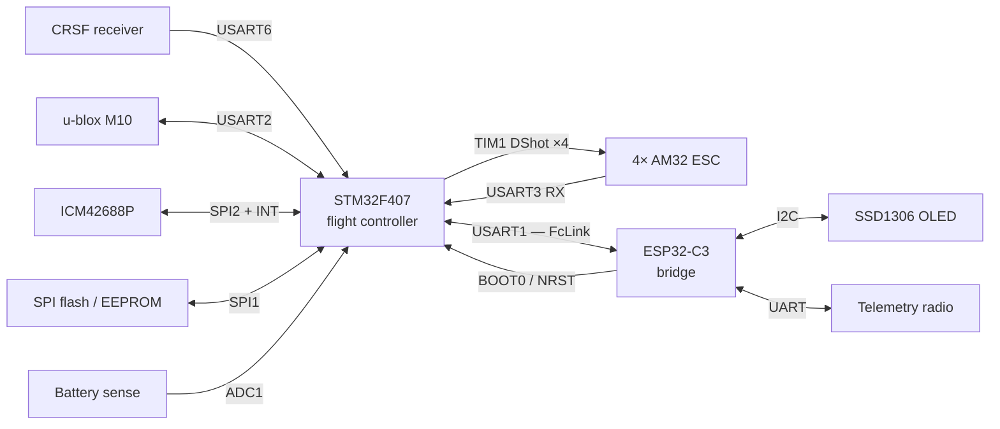

# Wiring — the reference build

Every signal in the aircraft, grouped by the thing it connects to. This is the page to have
open while you solder.

!!! danger "Before you touch anything"

    Flight battery **disconnected**, propellers **off**, iron on a stand. A shorted 6S pack
    will vaporise a trace before the breaker in your bench supply notices.

## How to read these tables

Pins come from `config/32raven.config` — the checked-in reference build. Each row names the
Kconfig symbol that sets it, so you can confirm the value yourself:

```bash
grep STM32_SPI2_SCK config/32raven.config
```

Most of these are Kconfig **choices**, not fixed silicon. If your board routes a signal
differently, change it in `make 32raven-menuconfig` rather than reworking the PCB — the
build validates every pin against ST's silicon data and aborts on an impossible
(pin, alternate-function) pair.

!!! note "Two UARTs are not in the pin map"

    USART1 (FcLink) and USART6 (RC receiver) have **no entries in `PINMAP_ENTRIES`**
    (`scripts/generate_stm32_config.py`), so they are neither menuconfig-tunable nor covered
    by `scripts/lint/check_pinmap.py`. Their framing is configurable; their pins are not.
    Confirm them against your board before wiring — the tables below mark them explicitly.

## Signal overview



## Inter-MCU link — FcLink

The one connection that must be right before anything else works. Cross TX to RX.

| Signal | ESP32-C3 | STM32F407 | Kconfig symbol |
|--------|----------|-----------|----------------|
| FcLink TX → FC RX | `GPIO4` | USART1 RX *(not in pin map)* | `CONFIG_ESP32_PINMAP_FCLINK_UART_TX_GPIO_NUM` |
| FcLink RX ← FC TX | `GPIO3` | USART1 TX *(not in pin map)* | `CONFIG_ESP32_PINMAP_FCLINK_UART_RX_GPIO_NUM` |
| Ground | `GND` | `GND` | — |

Framing is **921600 baud, 9 data bits, even parity, 1 stop bit, no flow control** — set by
`CONFIG_ESP32_FCLINK_UART_BAUD_921600`, `CONFIG_STM32_FCLINK_UART_WORD_LENGTH_9BITS`, and
`CONFIG_STM32_FCLINK_UART_PARITY_EVEN`. The baud is owned by the ESP32 side; the STM32
follows it.

!!! tip "Keep this link short"

    921600 baud over long unshielded wire inside a frame full of ESC switching noise is a
    good way to spend an evening debugging handshake failures. Twist TX/RX with ground.

### STM32 programming lines

The ESP32 reflashes the STM32 over the air by driving its bootloader pins directly. Without
these two wires, `make flash-wifi-stm32` cannot work.

| Signal | ESP32-C3 | STM32F407 | Kconfig symbol |
|--------|----------|-----------|----------------|
| BOOT0 | `GPIO0` | `BOOT0` | `CONFIG_ESP32_PINMAP_PROGRAMMER_BOOT0_GPIO_NUM` |
| NRST | `GPIO1` | `NRST` | `CONFIG_ESP32_PINMAP_PROGRAMMER_NRST_GPIO_NUM` |

## IMU — ICM42688P (SPI2)

| Signal | STM32F407 | Kconfig symbol |
|--------|-----------|----------------|
| SCK | `PB13` | `CONFIG_STM32_SPI2_SCK_PIN_PB13` |
| MISO (SDO) | `PB14` | `CONFIG_STM32_SPI2_MISO_PIN_PB14` |
| MOSI (SDI) | `PB15` | `CONFIG_STM32_SPI2_MOSI_PIN_PB15` |
| CS | `PA4` | `CONFIG_STM32_SPI2_CS_PORT_A` + `CONFIG_STM32_SPI2_CS_PIN` |
| INT (data ready) | `PB10` | `CONFIG_STM32_IMU_INT_PORT_B` + `CONFIG_STM32_IMU_INT_PIN` |

The INT line is not optional — the control loop is driven by the IMU's data-ready edge, not
by a timer. An unconnected INT is a flight controller that never runs.

!!! warning "Mounting matters more than wiring"

    Orientation and vibration isolation dominate IMU performance. Note which way the chip's
    X axis points as you mount it; the sensors stage will need it.

<!-- TODO(build): photo of the IMU mounted, axis arrow visible. -->

## GPS — u-blox M10 (USART2)

| Signal | STM32F407 | Kconfig symbol |
|--------|-----------|----------------|
| TX → GPS RX | `PA2` | `CONFIG_STM32_UART2_TX_PIN_PA2` |
| RX ← GPS TX | `PA3` | `CONFIG_STM32_UART2_RX_PIN_PA3` |

The driver configures the module at runtime (nav rate, message set), so the GPS does not need
pre-programming with u-center.

## RC receiver — CRSF (USART6)

| Signal | STM32F407 | Kconfig symbol |
|--------|-----------|----------------|
| RX ← receiver TX | USART6 RX *(not in pin map)* | — |
| TX → receiver RX | USART6 TX *(not in pin map)* | — |

CRSF runs at **420000 baud** (`CONFIG_STM32_RC_RECEIVER_UART_BAUD_420000`). It is a
half-duplex-style protocol over two wires; binding and channel mapping are covered in the RC
stage, not here.

## Motors — TIM1 DShot

Motor numbering follows the mixer, which is **not** the same as the physical arm order on
every frame. Wire by number now; confirm the mapping on the bench with props off.

| Motor | Timer channel | STM32F407 | Kconfig symbol |
|-------|---------------|-----------|----------------|
| 1 | TIM1_CH1 | `PE9` | `CONFIG_STM32_DSHOT_MOTOR1_PE9` |
| 2 | TIM1_CH2 | `PE11` | `CONFIG_STM32_DSHOT_MOTOR2_PE11` |
| 3 | TIM1_CH3 | `PE13` | `CONFIG_STM32_DSHOT_MOTOR3_PE13` |
| 4 | TIM1_CH4 | `PE14` | `CONFIG_STM32_DSHOT_MOTOR4_PE14` |

### ESC telemetry (USART3)

One shared RX-only line back from the ESCs.

| Signal | STM32F407 | Kconfig symbol |
|--------|-----------|----------------|
| Telemetry RX | `PB11` | `CONFIG_STM32_ESC_TLM_RX_PIN_PB11` |

The pin is configured with an internal pull-up because the line idles high and no ESC drives
it until one is polled.

<!-- TODO(build): ESC-to-FC harness photo, plus the AM32 telemetry-enable setting. -->

## Battery sense (ADC1)

| Signal | STM32F407 | Kconfig symbol |
|--------|-----------|----------------|
| Pack voltage | `PC0` | `CONFIG_STM32_BATTERY_VOLTAGE_PORT_C` + `CONFIG_STM32_BATTERY_VOLTAGE_PIN` |
| Pack current | `PC1` | `CONFIG_STM32_BATTERY_CURRENT_PORT_C` + `CONFIG_STM32_BATTERY_CURRENT_PIN` |

!!! danger "Divider first, pin second"

    These go to a **divided** and clamped sense node, never to the pack. 6S is ~25 V fully
    charged; the F407 ADC input is 3.3 V tolerant. Verify the divider output with a meter
    before the wire ever reaches `PC0`.

<!-- TODO(build): divider values used on the reference build + measured scale factors. -->

## Onboard flash (SPI1)

Settings storage. Not flight-critical to have wired for a first power-on, but tuning will not
persist across reboots without it.

| Signal | STM32F407 | Kconfig symbol |
|--------|-----------|----------------|
| SCK | `PB3` | `CONFIG_STM32_SPI1_SCK_PIN_PB3` |
| MISO | `PB4` | `CONFIG_STM32_SPI1_MISO_PIN_PB4` |
| MOSI | `PB5` | `CONFIG_STM32_SPI1_MOSI_PIN_PB5` |
| CS | `PA15` | `CONFIG_STM32_SPI1_CS_PORT_A` + `CONFIG_STM32_SPI1_CS_PIN` |

## STM32 user I/O

| Signal | STM32F407 | Kconfig symbol |
|--------|-----------|----------------|
| Status LED | `PA1` | `CONFIG_STM32_USER_LED_PORT_A` + `CONFIG_STM32_USER_LED_PIN` |
| User button | `PA0` | `CONFIG_STM32_USER_BTN_PORT_A` + `CONFIG_STM32_USER_BTN_PIN` |

Polarity for both is a separate Kconfig switch (`CONFIG_STM32_LED_ACTIVE_LOW`,
`CONFIG_STM32_BUTTON_ACTIVE_LOW`) — set it to match your wiring instead of adding a
transistor.

## ESP32-C3 peripherals

| Signal | ESP32-C3 | Kconfig symbol |
|--------|----------|----------------|
| Status LED | `GPIO8` | `CONFIG_ESP32_PINMAP_LED_GPIO_NUM` |
| Button | `GPIO9` | `CONFIG_ESP32_PINMAP_BUTTON_GPIO_NUM` |
| Buzzer | `GPIO10` | `CONFIG_ESP32_PINMAP_BUZZER_GPIO_NUM` |
| OLED SDA | `GPIO5` | `CONFIG_ESP32_PINMAP_SSD1306_PANEL_I2C_SDA_GPIO_NUM` |
| OLED SCL | `GPIO6` | `CONFIG_ESP32_PINMAP_SSD1306_PANEL_I2C_SCL_GPIO_NUM` |
| Telemetry TX | `GPIO20` | `CONFIG_ESP32_PINMAP_TELEM_UART_TX_GPIO_NUM` |
| Telemetry RX | `GPIO21` | `CONFIG_ESP32_PINMAP_TELEM_UART_RX_GPIO_NUM` |

`GPIO9` is the ESP32-C3's strapping pin for download mode. Holding the user button through a
reset will drop the bridge into the ROM bootloader instead of running firmware — inconvenient
in the field, so consider where you mount it.

## Before you power anything

- [ ] Continuity-check every ground between the two boards.
- [ ] Confirm no pin appears twice across the tables above — the build enforces this for
      pin-map entries, but the two off-map UARTs are yours to check.
- [ ] Confirm the battery divider output with a meter at full pack voltage.
- [ ] Propellers still off.

Next: power and ESC configuration *(not yet written — see the
[running order](index.md#running-order))*.

<!-- TODO(build): full-aircraft wiring photo with callouts, once assembly is done. -->
