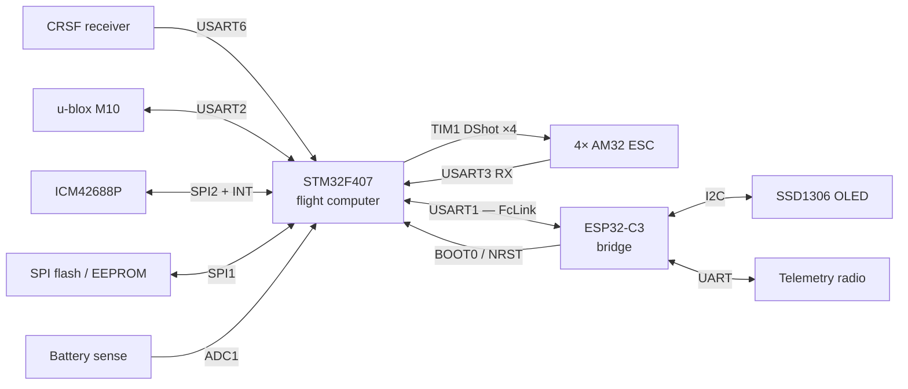

# Wiring — the reference build

Every signal in the aircraft, grouped by the thing it connects to. This is the page to have
open while you solder — flight battery disconnected throughout.

## How to read these tables

Pins come from `config/32raven.config` — the checked-in reference build, not a suggestion.

Most of them are Kconfig **choices**, not fixed silicon. If your board routes a signal
differently, change it in `make 32raven-menuconfig` rather than reworking the PCB — the
build validates every pin against ST's silicon data and aborts on an impossible
(pin, alternate-function) pair.

!!! note

    **Two UARTs are not in the pin map.** USART1 (FcLink) and USART6 (RC receiver) have **no
    entries in `PINMAP_ENTRIES`** (`scripts/generate_stm32_config.py`), so they are neither
    menuconfig-tunable nor covered by `scripts/lint/check_pinmap.py`. Their framing is
    configurable; their pins are not. Confirm them against your board before wiring. Tracked
    as roadmap item #5.

## Signal overview

## Inter-MCU link — FcLink

<!-- --8<-- [start:fclink] -->
The one connection that must be right before anything else works. Cross TX to RX.

| Signal | ESP32-C3 | STM32F407 |
|--------|----------|-----------|
| FcLink TX → FC RX | `GPIO4` | USART1 RX *(not in pin map)* |
| FcLink RX ← FC TX | `GPIO3` | USART1 TX *(not in pin map)* |
| Ground | `GND` | `GND` |

!!! tip

    **Keep this link short.** The reference build runs the link at **921600 baud**
    (`CONFIG_ESP32_FCLINK_UART_BAUD_921600`). It is set on the ESP32 side and the STM32
    follows it, so both ends stay matched from one setting — the choice runs 9600 to 5 M under
    `make 32raven-menuconfig` → **ESP32 → FcLink → Uart**, where the Kconfig default is 5 M
    rather than the 921600 checked in here.

    Even at 921600, long unshielded wire inside a frame full of ESC switching noise is a good
    way to spend an evening debugging handshake failures. Twist TX/RX with ground, and if the
    run has to be long, drop the baud rather than fight the noise.
<!-- --8<-- [end:fclink] -->

### STM32 programming lines

<!-- --8<-- [start:programming] -->
The two lines the bridge drives to put the flight computer into its ROM bootloader. This is
how the STM32 gets its firmware: its own USB port is never used, so every update reaches it
through the bridge.

| Signal | ESP32-C3 | STM32F407 |
|--------|----------|-----------|
| BOOT0 | `GPIO0` | `BOOT0` |
| NRST | `GPIO1` | `NRST` |
<!-- --8<-- [end:programming] -->

`BOOT0` is reachable two ways, and `NRST` only one — see
[where these signals live](boards.md#bootloader-control-lines).

## IMU — ICM42688P (SPI2)

| Signal | STM32F407 |
|--------|-----------|
| SCK | `PB13` |
| MISO (SDO) | `PB14` |
| MOSI (SDI) | `PB15` |
| CS | `PA4` |
| INT (data ready) | `PB10` |

The INT line is not optional — the control loop is driven by the IMU's data-ready edge, not
by a timer. An unconnected INT is a control loop that never runs.

!!! note

    **Mounting matters more than wiring.** Orientation and vibration isolation dominate IMU
    performance. Note which way the chip's X axis points as you mount it; the sensors stage
    will need it.

<!-- TODO(build): photo of the IMU mounted, axis arrow visible. -->

## GPS — u-blox M10 (USART2)

| Signal | STM32F407 |
|--------|-----------|
| TX → GPS RX | `PA2` |
| RX ← GPS TX | `PA3` |

The driver configures the module at runtime (nav rate, message set), so the GPS does not need
pre-programming with u-center.

## RC receiver — CRSF (USART6)

| Signal | STM32F407 |
|--------|-----------|
| RX ← receiver TX | USART6 RX *(not in pin map)* |
| TX → receiver RX | USART6 TX *(not in pin map)* |

CRSF runs at **420000 baud** (`CONFIG_STM32_RC_RECEIVER_UART_BAUD_420000`). It is a
half-duplex-style protocol over two wires; binding and channel mapping are covered in the RC
stage, not here.

## Motors — TIM1 DShot

Motor numbering follows the mixer, which is **not** the same as the physical arm order on
every frame. Wire by number now; confirm the mapping on the bench with props off.

| Motor | Timer channel | STM32F407 |
|-------|---------------|-----------|
| 1 | TIM1_CH1 | `PE9` |
| 2 | TIM1_CH2 | `PE11` |
| 3 | TIM1_CH3 | `PE13` |
| 4 | TIM1_CH4 | `PE14` |

### ESC telemetry (USART3)

One shared RX-only line back from the ESCs.

| Signal | STM32F407 |
|--------|-----------|
| Telemetry RX | `PB11` |

The pin is configured with an internal pull-up because the line idles high and no ESC drives
it until one is polled.

<!-- TODO(build): ESC-to-FC harness photo, plus the AM32 telemetry-enable setting. -->

## Battery sense (ADC1)

| Signal | STM32F407 |
|--------|-----------|
| Pack voltage | `PC0` |
| Pack current | `PC1` |

!!! warning

    **Divider first, pin second.** These go to a **divided** and clamped sense node, never to
    the pack. 6S is ~25 V fully charged; the F407 ADC input is 3.3 V tolerant. Verify the
    divider output with a meter before the wire ever reaches `PC0`.

<!-- TODO(build): divider values used on the reference build + measured scale factors. -->

## Onboard flash (SPI1)

Settings storage. Not flight-critical to have wired for a first power-on, but tuning will not
persist across reboots without it.

| Signal | STM32F407 |
|--------|-----------|
| SCK | `PB3` |
| MISO | `PB4` |
| MOSI | `PB5` |
| CS | `PA15` |

## STM32 user I/O

| Signal | STM32F407 |
|--------|-----------|
| Status LED | `PA1` |
| User button | `PA0` |

Polarity for both is a separate Kconfig switch (`CONFIG_STM32_LED_ACTIVE_LOW`,
`CONFIG_STM32_BUTTON_ACTIVE_LOW`) — set it to match your wiring instead of adding a
transistor.

## ESP32-C3 peripherals

| Signal | ESP32-C3 |
|--------|----------|
| Status LED | `GPIO8` |
| Button | `GPIO9` |
| Buzzer | `GPIO10` |
| OLED SDA | `GPIO5` |
| OLED SCL | `GPIO6` |
| Telemetry TX | `GPIO20` |
| Telemetry RX | `GPIO21` |

On the reference bridge board (the 0.42" OLED module), the first five rows are **already wired
on the board** — the LED, the BOOT button and the OLED are not yours to connect. Only the
buzzer and the telemetry UART leave the board.

!!! caution

    **The board's RX/TX labels are inverted relative to this firmware.** The silkscreen marks
    `GPIO20` as **RX** and `GPIO21` as **TX**, following the chip's default UART0 assignment.
    This firmware drives them the other way round — `GPIO20` is telemetry **TX**
    (`CONFIG_ESP32_PINMAP_TELEM_UART_TX_GPIO_NUM`) and `GPIO21` is **RX**.

    The ESP32-C3 routes any UART to any pin through its GPIO matrix, so this is legal and
    works. It also means wiring by the printed label gives you a dead link with no error and
    nothing in the logs. Wire by GPIO number.

`GPIO9` is the ESP32-C3's strapping pin for download mode. Holding the user button through a
reset will drop the bridge into the ROM bootloader instead of running firmware — inconvenient
in the field, so consider where you mount it.

## Before you power anything

- [ ] Continuity-check every ground between the two boards.
- [ ] Confirm no pin appears twice across the tables above — the build enforces this for
      pin-map entries, but the two off-map UARTs are yours to check.
- [ ] Confirm the battery divider output with a meter at full pack voltage.

Next: power and ESC configuration *(not yet written)*.

<!-- TODO(build): full-aircraft wiring photo with callouts, once assembly is done. -->
