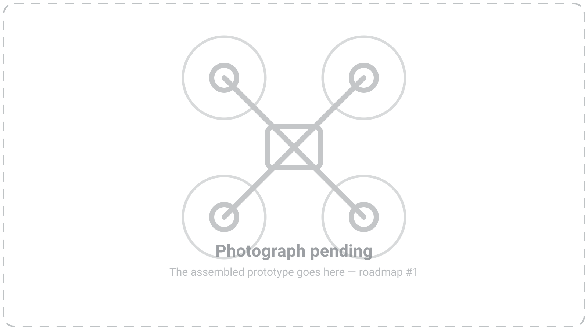

# 32Raven Handbook

**32Raven** is a bare-metal flight-control stack split across two MCUs: an **STM32F407**
running the flight-critical loop and an **ESP32-C3** carrying the connectivity surface.
They share nothing but a versioned wire protocol.

This handbook is the practical layer — how to **build one**, wire it, flash it, bring it up,
and fly it. The build guide covers the hardware in front of you; the
[firmware section](firmware/index.md) covers the architecture, the toolchain, and the build.

## At a glance

-   :material-quadcopter:{ .lg .middle } **Airframe**

    ---

    `TBD(#3)`

-   :material-chip:{ .lg .middle } **Flight computer**

    ---

    STM32F407 — control loop, IMU, GPS, RC, mixer

-   :material-wifi:{ .lg .middle } **Connectivity**

    ---

    ESP32-C3 — MAVLink/CRSF, WiFi, OTA, on-device UI

-   :material-battery-high:{ .lg .middle } **Power**

    ---

    6S pack — `TBD(#3)` for capacity and all-up weight

-   :material-cash-multiple:{ .lg .middle } **Parts cost**

    ---

    `TBD(#2)`

-   :material-timer-outline:{ .lg .middle } **Build time**

    ---

    `TBD(#2)`

Anything marked `TBD(#N)` is an open item on the [roadmap](roadmap.md).

!!! info

    **Status: active development.** Interfaces, configs, and pin assignments change quickly.

!!! danger

    **This aircraft can injure you.** A 6S quadcopter with props on is a serious hazard.
    Nothing in this handbook is a substitute for your own judgement: props stay **off** the
    motors until the bench-test stage explicitly says otherwise, and the battery stays
    disconnected while you wire.

## Where this handbook stands

It is being written **right now**, alongside the first from-scratch build of the prototype —
the aircraft and its documentation are being assembled together. Pages appear as that
aircraft reaches the stage they describe.

**[Start with the build guide →](build/index.md)**
